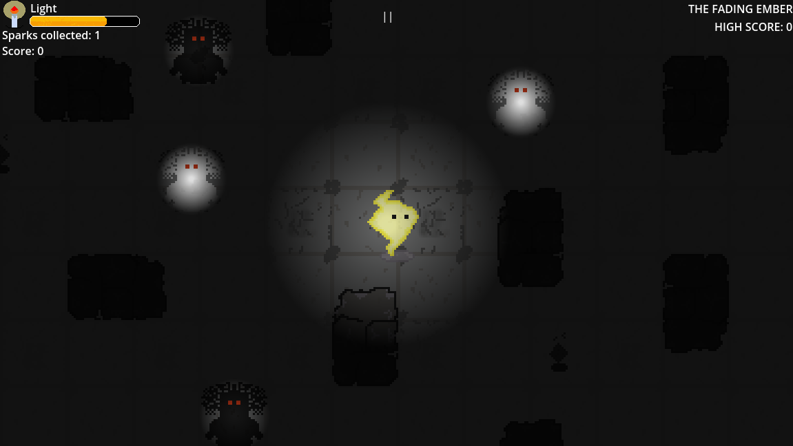
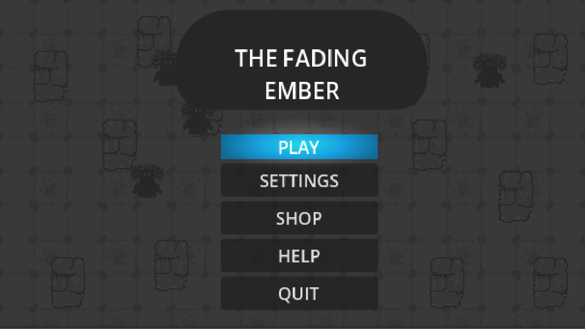
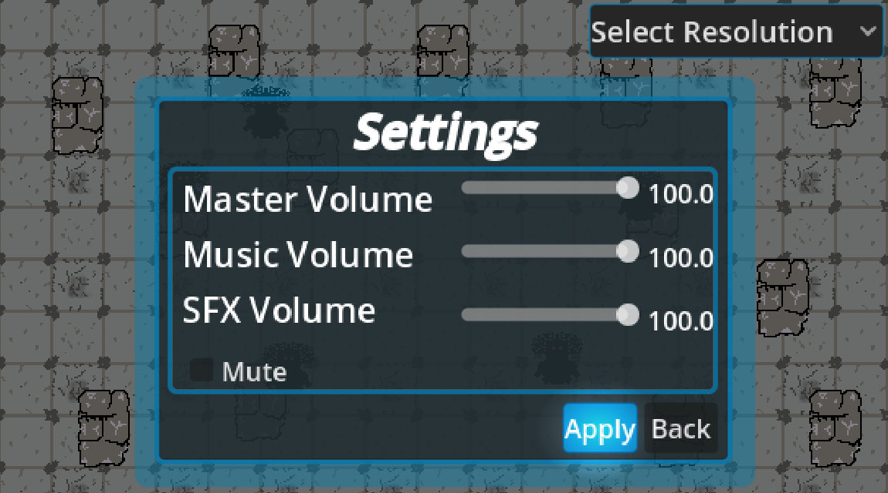
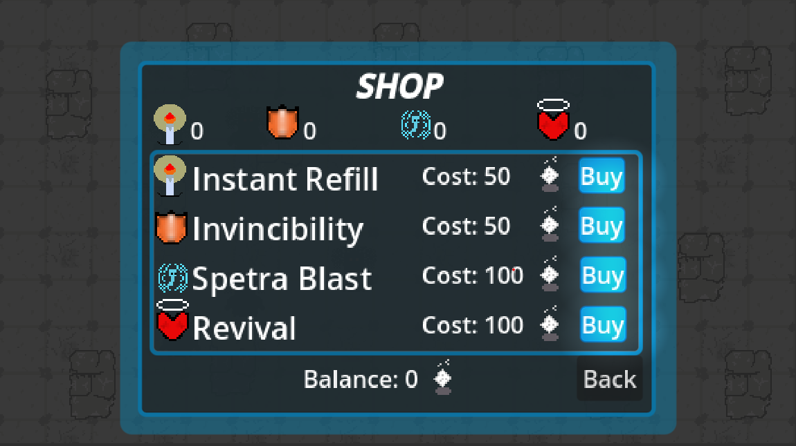

# **The Fading Ember**


A 2D top-down survival arcade game where you play as a single ember lost in an abyss. Your only weapon and life is your glow.
---
## features
- Responsive movement
- Intelligent enemy ai
- navigation agent
- Sound effects and music
- Pointlight scaling

## Preview
<p align="center">

</p>

## GamePlay
<p align="center">
<video controls src="gameplay.mp4">
</p>

## MainMenu
<p align="center">

</p>

## Settings
<p align="center">

</p>

## Shop
<p align="center">

</p>

# Controls
| Action | Keyboard |
|--------|-----------|
| Move   | WASD / Arrow Keys |

# Project Structure
Explore the full directory tree: [View on GitHub](github.com/maltech0005-tech/The-Fading-Ember/tree/main)

```text
The-Fading-Ember/
├── assets/
├── scenes/
├── script/
├── export_presets.cfg
├── icon.svg
├── project.godot
└── README.md
```
---

# Ai Usage
- This project is fully human written, no copy and paste or typying of code directly from ai source was practiced.

# Assets Sources
- All sprites were originally designed and created using [libresprite](https://libresprite.github.io) ([Aseprite](https://www.aseprite.org) alternative) 
- All sounds were freely downloaded from  from https://pixabay.com
